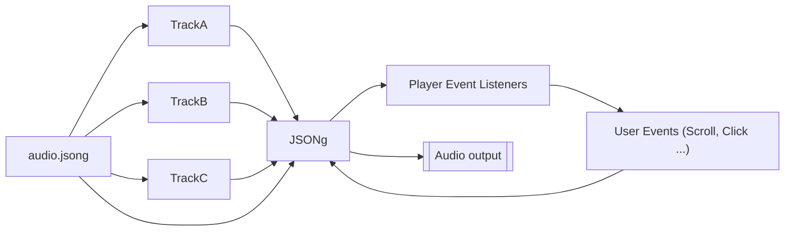

# JSONg-Audio

## *WIP*


<a href="https://tonejs.github.io/"></a>



## A dynamic music representation and playback format.

# What is it and how does it work?
This format is designed specifically to provide dynamic instructions to dynamic music interpreter *(a [`JSONg`](API.md#control-methods) player)* on how to manage tracks, volumes, looping and user interactions. 

The `*.jsong` file itself has instructions on how to playback the music based on dynamic user input events, such as a page scroll, or mouse hover...

The `*.jsong` file can also contain music encoded as data URI to allow a stand alone, single file approach.

### Inspiration
The idea came from two wonderful games, [TrackMania Turbo](https://www.ubisoft.com/en-gb/game/trackmania/turbo)) where the music has a different feel based on the speed of the car, and [Sonic Heroes' Mystic Mansion](https://sonic.fandom.com/wiki/Mystic_Mansion#Music) level where the music stays in different sections of music until you go to different parts of the level. One big inspiration is also [Ableton Live](https://ableton.com) in how it allows to dynamically mix and match audio clips to build a song 'live', much of the code and analogies are based on how Live behaves.

# API
Available in [API.md](API.md). The core functions of the player are described. For examples see the 'Examples' folder.

# Dependencies
As of now, the music player and event scheduler is <a href="https://tonejs.github.io/">Tone.js</a>. It provides music playback of multiple music streams, as well as the scheduling of events, aligned to musical time of the song based on its BPM.

# Concepts
The <code>*.jsong</code> file describes how the player should play the music and how it should react to events. Below is a typical file structure.

## Project File and loading
To begin, create a new player by making a new object
`const player = new JSONg(verbose: boolean)`

You may then provide the `*.jsong` file containing all the music within, or, provide a name of a folder containing all music data as well as a `audio.jsong` manifest file. 

## Playback
By default, if you call the [`play`](API.md#jsongplayindex--undefined-skip--false-fadeintime--1m) and [`stop`](API.md#jsongstopafter--time-fadeout--true) functions, a small fade in and fade out is provided. This is optional and you can either specify your own length (in [Tone units](https://github.com/Tonejs/Tone.js/wiki/Time)) or provide a 0 for instant start and stop.

## Flow
The *flow* describes how the song should flow from section to section. This array of section names can contain other arrays within, similar to [repeats](https://en.wikipedia.org/wiki/Repeat_sign) in music. 
```
[
  "intro", ["bass", [2, "chorus", "verse"]]
]
```
In this example the *intro* section is the first one and will normally be played first (unless overridden).
The second entry is a double repeat array.
 
The outer array (`["bass", ...]`) repeats infinitely unless the player is instructed to break out of the loop. 

The inner most array (`[2, "chorus", "verse"]`) has the number of maximum repeats as the first entry, in this case, this means after the second time the player reaches the verse it will step out of the loop and move onto the next section, here it would be `"bass"`.

## Indexing
To refer to the sections in the flow, a multi stage index is used, for example to refer to `"intro"` an index of `[0]` is used. For nested sections like the `"bass"`, an index of `[1,0]` is used, where the first number is the top level of the flow and any number following is in another level of the flow:
```
index   sections
[0]     "intro",
[1]     [  
[1,0]     "bass",
[1,1]     [
*          2, 
[1,1,0]    "chorus", 
[1,1,1]    "verse"
          ]
        ] 
```
**Note: the repetition limit number is ignored and should be skipped when counting indexes*

## Events 
There are a number of events that the player emits to further help you with the dynamic and interactive aspect of the player. The most useful being the [onSectionPlayStart](API.md#jsongonsectionplaystart--index) or [onSectionWillStart](API.md#jsongonsectionwillstart--index)

## Example File layout
<summary style="font-size:2rem"> <code>audio.jsong</code> - example file:</summary>
<pre>
{<span style="color: #987284;">
  "<a href="#file-information">type</a>": "jsong",
  "jsongVersion":"0.0.1",
  "<a href="#file-information">meta</a>": {
    "title": "Example JSONg",
    "author": "Damian Nowacki",
    "createdOn" : "20230325",
    "timestamp" : "1679741210",
    "projectVersion": "1.0.0",
    "createdUsing": ""
  },</span>
  <span style="color: #A3333D;"><a href="#playback"><u>"playback</a>": {</u>
    "bpm": 95.0,
    "meter": [4, 4],
    "metronome": ["B5","G4"],
    "metronomeDB": -8,
    "totalMeasures": 56,
    "grain": 4,
    <span style="color: #44CCFF;"><u>"<a href="#map">map</a>": {</u>
      "intro" : { "region": [0, 8]},
      "chorus" : { "region": [8, 24], "grain": 8},
      "verse1" : { "region": [24, 32]},
      "bridge1" : { "region": [32, 40], "grain": 2},
      "verse2" : { "region": [40, 56], "grain": 2}
    },</span>
    <span style="color: #5E4352;"><u>"<a href="#flow">flow"</a>: [</u>
      "intro", 
      "chorus", 
      "verse1", 
      "bridge1", 
      <u><a href="#subsection">[4, "verse2", "bridge1"],</a></u>
      <u><a href="#subsection">["chorus","verse2"],</a></u>
      <u><a href="#subsection">["intro"]</a></u>
    ]</span>
  },</span>
  <span style="color: #1B512D;">"<a href="#tracks">tracks</a>": [
    {
      "name": "drums",
      "volumeDB": 0,
    },
    {
      "name": "bass",
      "volumeDB": 0,
    }
  ],</span>
  "data" : {
    "drums": "data:audio/wav;base64,UklGRi...",
    "bass": "./bass.mp3"
  }
}
</pre>
<br/>

## File Information
<pre>
<span style="color: #987284;">"type": "jsong",
    "jsongVersion":"0.0.1",
    "meta": {
    "title": "Test",
    "author": "Damian Nowacki",
    "createdOn" : "20230325",
    "timestamp" : "1679741210",
    "projectVersion": "1.0.0",
    "createdUsing": ""</span>
</pre>
These are basic information about the file and a compatible version of the player that can be used to play it back.
`jsongVersion` shows which version of the interpreter is compatible for playback.

## Playback
<pre>
<span style="color: #A3333D;">"playback": {
    "bpm": 95.0,
    "meter": [4, 4],
    "metronome": ["B5","G4"],
    "metronomeDB": -8,
    "totalMeasures": 56,
    "grain": 4,
</pre>
The playback object describes the player timeline information like the BPM of the song and the <a href="https://en.wikipedia.org/wiki/Time_signature">meter</a> it is in e.g. 4/4 or 6/8

The length of the song is provided in <a href="https://en.wikipedia.org/wiki/Bar_(music)">Bars</a>.
The grain is provided in <a href="https://en.wikipedia.org/wiki/Beat_(music)#:~:text=In%20music%20and%20music%20theory,level%20(or%20beat%20level).">Beats</a> and describes the granilarity of <a href="https://en.wikipedia.org/wiki/Quantization_(music)">Quantization</a> of the event scheduling, i.e. when it is appropriate to start the next section for example upon reacting to a user event that is not in time to music

## Map
<pre>
<span style="color: #44CCFF;">"map": {
    "intro"   : { "region": [0, 8]},
    "chorus"  : { "region": [8, 24], "grain": 8},
    "verse1"  : { "region": [24, 32], "grain": 4},
    "bridge1" : { "region": [32, 40], "grain": 4},
    "verse2"  : { "region": [40, 48], "grain": 4}
},</span>
</pre>

A song can be divided into re-usable regions.
Each of these sections has a name e.g. 'chorus'.
`region` has two values; `[startBar, endBar]` where the length of the section is defined within those timestamps.
The song <a href="https://en.wikipedia.org/wiki/Quantization_(music)">Quantization</a> can be overridden for a particular section to enable quicker or slower queueing up of next sections of music.

## Flow
<pre>
<span style="color: #5E4352;">flow": [
    "intro", 
    "chorus", 
    "verse1", 
    "bridge1", 
    <u><a href="#subsection">[4, "verse2", "bridge1"],</a></u>
    <u><a href="#subsection">["chorus","verse2"],</a></u>
    <u><a href="#subsection">["intro"]</a></u> ...
]</span>
</pre>

The `flow` of the song is mapped out with an array of literal names of sections from [`map`](#map), either a singleton entry or a sub array of section called a [sub-section](#subsection).

### Subsection
A subsection is like a Repeat in music, except you can specify how many time the section should repeat. `[4, "verse2", "bridge1"],` if no number is specified as the first entry, it is assumed the section repeats infinitely but can be broken out of if instructed to do so when calling player's [skip](API.md#jsongskip) function.

## Tracks
<pre>
<span style="color: #1B512D;">"<a href="#tracks">tracks</a>": [
{
    "name": "drums",
    "volumeDB": 0,
    "source": <i>hashID</i>,
}, ...
</pre>

The name is a track name label serving as a reference, the source describes which audio buffer to use for music playback. See [`Tone.Player`](https://tonejs.github.io/docs/14.7.77/Player.html) for more.

## Data
This section contains either URL or data URI of actual sound files that make up the song