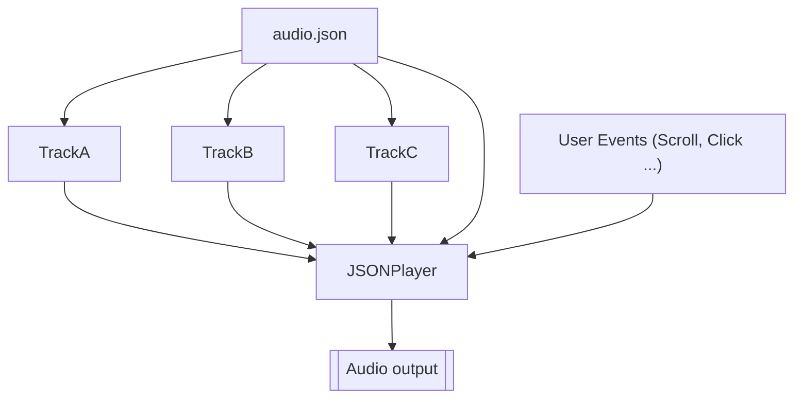

# JSON-Audio

## *WIP*

A dynamic music representation format.

This format is designed specifically to provide dynamic instructions to a `JSONPlayer` on how to manage track volumes and looping of certain sections. The `.json` file itself has instructions on how to playback the music based on dynamic user input events, such as a page scroll, or mouse hover...
The `.json` file can also contain music encoded as data URI (coming soon)

# Dependancies
As of now, the music player and event scheduler is <a href="https://tonejs.github.io/">Tone.js</a>. It provides music playback of multiple music streams, as well as schedules events aligned to musical time of the song based on its BPM.

# Concepts
The <code>audio.json</code> file describes how the player should play the music and how it should react to events. Below is a typical file structure 

 <code>audio.json</code> - example file:

<pre>
{
  "<a href="#file-information">type</a>": "jsonAudio",
  "jsonAudioVersion":"0.0.1",
  "<a href="#file-information">meta</a>": {
    "title": "Test",
    "author": "Damian Nowacki",
    "createdOn" : "20230325",
    "projectVersion": "1.0.0",
    "createdUsing": ""
  },
  <a href="#playback"><u>"playback</a>": {</u>
    "bpm": 95.0,
    "meter": [4, 4],
    "metronome": ["B5","G4"],
    "metronomeDB": -8,
    "length": 56,
    "grain": 4,
    <u>"<a href="#map">map</a>": {</u>
      "intro" : { "region": [0, 8]},
      "chorus" : { "region": [8, 24], "grain": 8},
      "verse1" : { "region": [24, 32], "grain": 4},
      "bridge1" : { "region": [32, 40], "grain": 4},
      "verse2" : { "region": [40, 48], "grain": 4}
    },
    <u>"<a href="#flow">flow"</a>: [</u>
      "intro", 
      "chorus", 
      "verse1", 
      "bridge1", 
      <u><a href="#subsection">[4, "verse2", "bridge1"],</a></u>
      <u><a href="#subsection">["chorus","verse2"],</a></u>
      <u><a href="#subsection">["intro"]</a></u>
    ]
  },
  "<a href="#tracks">tracks</a>": [
    {
      "name": "drums",
      "source": "./drums.mp3",
      "volumeDB": 0,
      "mute": false,
      "offset": 0,
      "length": 56
    },
    {
      "name": "bass",
      "source": "./bass.mp3",
      "volumeDB": 0,
      "mute": false,
      "offset": 0,
      "length": 56
    },
    {
      "name": "guitar",
      "source": "./guitar.mp3",
      "volumeDB": 0,
      "mute": false,
      "offset": 0,
      "length": 56
    },
    {
      "name": "lead",
      "source": "./lead.mp3",
      "volumeDB": 0,
      "mute": false,
      "offset": 0,
      "length": 56
    }
  ]
}
</pre>
 

## File Information
<pre>
"type": "jsonAudio",
    "jsonAudioVersion":"0.0.1",
    "meta": {
    "title": "Test",
    "author": "Damian Nowacki",
    "createdOn" : "20230325",
    "projectVersion": "1.0.0",
    "createdUsing": ""
</pre>
These are basic information about the file and a compatible version of the player that can be used to play it back.
`jsonAudioVersion` shows which version of the interpreter is compatible for playback.

## Playback
<pre>
"playback": {
    "bpm": 95.0,
    "meter": [4, 4],
    "metronome": ["B5","G4"],
    "metronomeDB": -8,
    "length": 56,
    "grain": 4,
</pre>
The playback object describes the player timeline information like the BPM of the song and the <a href="https://en.wikipedia.org/wiki/Time_signature">meter</a> it is in e.g. 4/4 or 6/8

The length of the song is provided in <a href="https://en.wikipedia.org/wiki/Bar_(music)">Bars</a>.
The grain is provided in <a href="https://en.wikipedia.org/wiki/Beat_(music)#:~:text=In%20music%20and%20music%20theory,level%20(or%20beat%20level).">Beats</a> and describes the granilarity of <a href="https://en.wikipedia.org/wiki/Quantization_(music)">Quantization</a> of the event scheduling, i.e. when it is appropriate to start the next section for example upon reacting to a user event that is not in time to music

## Map
<pre>
"map": {
    "intro"   : { "region": [0, 8]},
    "chorus"  : { "region": [8, 24], "grain": 8},
    "verse1"  : { "region": [24, 32], "grain": 4},
    "bridge1" : { "region": [32, 40], "grain": 4},
    "verse2"  : { "region": [40, 48], "grain": 4}
},
</pre>

A song can be divided into re-usable regions.
Each of these sections has a name e.g. 'chorus'.
`region` has two values; `[startBar, endBar]` where the length of the section is defined within those timestamps.
The song <a href="https://en.wikipedia.org/wiki/Quantization_(music)">Quantization</a> can be overridden for a particular section to enable quicker or slower queueing up of next sections of music.

## Flow
<pre>
flow": [
    "intro", 
    "chorus", 
    "verse1", 
    "bridge1", 
    <u><a href="#subsection">[4, "verse2", "bridge1"],</a></u>
    <u><a href="#subsection">["chorus","verse2"],</a></u>
    <u><a href="#subsection">["intro"]</a></u> ...
]
</pre>

The `flow` of the song is mapped out with an array of literal names of sections from [`map`](#map), either a singleton entry or a sub array of section called a [sub-section](#subsection).

### Subsection
A subsection is like a Repeat in music, except you can specify how many time the section should repeat. `[4, "verse2", "bridge1"],` if no number is specified as the first entry, it is assumed the section repeats infinitely and can only be broken out of through [`JSONPlayer.next(true)`](#jsonplayernextbreakout) or [`JSONPlayer.goTo(region)`](#jsonplayergotoregionname)

## Tracks
<pre>
"<a href="#tracks">tracks</a>": [
{
    "name": "drums",
    "source": "./drums.mp3",
    "volumeDB": 0,
    "mute": false,
    "offset": 0,
    "length": 56
}, ...
</pre>

The name is a track name label serving as a reference, the source is the URI to the data file containing the track music to be loaded into [`Tone.Player`](https://tonejs.github.io/docs/14.7.77/Player.html).
The length and offset describe the length of the music file in <a href="https://en.wikipedia.org/wiki/Bar_(music)">Bars</a> and the offset should say when the file should begin playing for the first time.

 

# Event Listeners

### `JSONPlayer.onRegionStart((regionName)=>{})`
### `JSONPlayer.onRegionEnd((regionName)=>{})`

### `JSONPlayer.onRegionWillStart((regionName)=>{})`

### `JSONPlayer.onRegionWillEnd((regionName)=>{})`

### `JSONPlayer.onRegionTransport((regionName, beat, totalRegionBeats)=>{})`

### `JSONPlayer.onSongTransport((currentRegionName, beat, totalRegionBeats)=>{})`

# Control Methods
### `JSONPlayer`:

`const player = new JSONPlayer(audio.json)`

This class is instanciated with the `new` keyword and has the following methods:

### `JSONPlayer.parse(data)` / `new JSONPlayer(data)`
> Parses the JSON file internally and loads any music files required to represent the song.

### `JSONPlayer.start()`
> Starts music playback from current section, with current settings 

### `JSONPlayer.stop()`
> Stop music playback.

### `JSONPlayer.next(breakOut)`
> Go to the next section in the flow map defined in `audio.json`, current grain settings apply.

### `JSONPlayer.goTo(regionName)`
> Go to the named region section in the region map defined in `audio.json`, current grain settings apply.

### `JSONPlayer.rampTrackVolume(trackIndex, db, inTime = 0, sync = true)`
> Adjust track volume

### `JSONPlayer.rampTrackFilter(trackIndex, freq, inTime = 0, sync = true)`
> Adjust track Low Pass filter

### `audio.json`:
> This file maps out sections of music and loop regions as well as all other settings for the player like track volumes and the flow of music for guiding the player through the sections. Can contain audio data in form of data URI or can point to sound files (relative path to `.json` file).
 
*See [Concepts](#concepts)*
