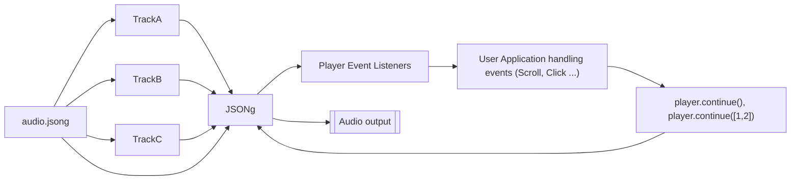

# JSONg-Audio

<div style="text-align: center">

<a href="https://tonejs.github.io/"></a>

</div>

<p style="text-align:center; width:100%">
A dynamic music representation and playback format for interactive slideshows or mini games.
<br/>
<b>Audio enhanced presentation</b>
</p>

`npm i jsong-audio`


# Examples

See live examples at the [jsong-audio repo](https://github.com/purewack/jsong-examples)
Choose from three frameworks in the examples:
- [vanilla](https://jsong-examples.onrender.com/vanilla/)
- [react](https://jsong-examples.onrender.com/react/)
- [vue](https://jsong-examples.onrender.com/vue/)

You can also create and test your own jsons using an online / electron [jsong-player](https://github.com/purewack/jsong-player)
There are also ready made songs for you to examine [here](https://github.com/purewack/jsong-examples/releases/sources)

# What is it and how does it work?
This format is designed specifically to provide dynamic instructions to dynamic music interpreter *(a [`JSONg`](API.md#control-methods) player)* on how to manage tracks, volumes, looping and user interactions. 

The `*.jsong` file itself has instructions on how to playback the music based on dynamic user input events, such as a page scroll, or mouse hover...

The `*.jsong` file can also contain music encoded as data URI to allow a stand alone, single file approach.

If you ever have seen how [Ableton Live](https://ableton.com) handles live music playback, this should be easy to understand.

# Usage Details
It is strongly recommended to use [docs/API.md](docs/API.md) as there are a lot of details on how everything works. This documents runs through how things work on a more basic level / use case.

# Dependencies
As of now, the music player and event scheduler is <a href="https://tonejs.github.io/">Tone.js</a>. It provides music playback of multiple music streams, as well as the scheduling of events, aligned to musical time of the song based on its BPM.

# Concepts
The <code>*.jsong</code> file describes how the player should play the music and how it should react to events. Below is a typical file structure.

## Project File and loading
To begin, create a new player by making a new object
```ts
const player = new JSONg(file: string | object, options?: ...)
```

You may then provide a pre-parsed `jsong` object containing instructions and directives, or, provide a name of a folder containing all music data as well as a `*.jsong` manifest file, or provide a direct path to the manifest file.

You can also take a less direct approach and choose to parse the file separately to ensure no errors are thrown before loading audio.
```ts
const player = new JSONg()
const manifest = player.parseManifest("test.jsong", {loadAudio: false})
if(manifest){
  player.useManifest(manifest).then(()=>{
    player.play()
  })
  .catch(...)
}
```

# Playback and Events
The player can have several states which naturally change over the course of the player's life. The most important are probably the `queue` / `continue` states, which signal an upcoming change. These can be listened for by attaching an event lister.
```ts
const player = new JSONg()
player.addEventListener("state", (ev: StateEvent)=>{
  console.log("Player State:",ev.stateNow, ev.statePrev)
})
```
See [docs/API.md](docs/API.md) for more details about all events.

## Flow
This is probably the most important concept of the player.

The *flow* describes how the song should flow from section to section. This array of section names can contain other arrays within, similar to [repeats](https://en.wikipedia.org/wiki/Repeat_sign) in music. 
```json
[
  "intro->", ["bass", [2, "chorus", "verse"]]
]
```
In this example the *intro* section is the first one and will normally be played first (unless overridden). It also contains the directive `">"`, meaning that the player will automatically go to the next section after `intro` reaches its end, unless cancelled.

The second entry is a double repeat array, referred to as a *group*.
 
The outer array (`["bass", ...]`) repeats infinitely unless the player is instructed to break out of the loop. 

The inner most array (`[2, "chorus", "verse"]`) has the number of maximum repeats as the first entry, in this case, this means after the second time the player reaches the verse it will step out of the loop and move onto the next section, here it would be `"bass"`.

## Flags / Directives
The sections in the flow can contain flags instructing the player on how the section should flow. Supported flags are `X` for cross fading into the *next* section, and `>` for automatically continuing on to the next section without user input. 

The list of flags is separated using `-` symbol, immediately after the flow name. 

Example:
```
["intro->", "verse1-X", "chorus-X->", "verse"]
```
The `intro->` will automatically play `verse1` after it reaches its own end.

`verse1-X` will crossfade into `chorus` while `chorus` will do both.

When fading, the player will take the current position of the current section and start the next section from that same point, meaning that if the current section is 4 bars and is on beat 3 or bar 2, and the section that the player is fading into is 2 bars long, the player will pick up from next section from bar 1 at beat 3.
The player will make sure to start at the same beat of the bar that the current section is at.

There is also the `|` legato flag which does what `X` does, except the fade time is 0.

### Flow explicit overrides
Instead of providing string entries in the flow array, you can also supply objects with explicit instructions.

See [docs/MANIFEST.md](docs/MANIFEST.md#flow) for a lot more on what you can put in the flow sections.


## Indexing
To refer to the sections in the flow, a multi stage index is used, for example to refer to `"intro"` an index of `[0]` is used. For nested sections like the `"bass"`, an index of `[1,0]` is used, where the first number is the top level of the flow and any number following is in another level of the flow:
```
index   sections
[0]     "intro",
[1]     [  
[1,0]     "bass",
[1,1]     [
*          2, 
[1,1,0]    "chorus", 
[1,1,1]    "verse"
          ]
        ] 
```

In this example `[1]` refers to the whole group containing `bass` etc, where as `[1,0]` refers to `bass` directly

**Note: the repetition limit number is ignored and should be skipped when counting indexes, it can be placed anywhere in the group array*

## Build sections and navigation
As the player parses the manifest files, if will take these details and *build* sections for its own use. These section details in the form of `PlayerSection` and/or `PlayerSectionGroup` will be handed to you in any event handler dealing with section details and indexes. As an example this is what built sections look like:

```ts
{
  loopCurrent: 0,
  loopLimit: Infinity,
  sectionCount: 2,
  0: {
    name:"A", 
    index:  [0], 
    next:   [1,0], 
    region: [0,4], 
    grain:4, 
    once:false, 
    transition: [...]},
  1: {
    loopCurrent: 0,
    loopLimit: 2,
    sectionCount: 4,
    0: {
      name:"B", 
      index:  [1,0], 
      next:   [1,1,0], 
      region: [0,4],  
      grain:4, 
      once:false, 
      transition: [...]},
    ...
  }
}
```

Navigating nested arrays is a bit complex because of the repeat counters `loopCurrent` and `loopLimit`.
Take for example these flow instructions: `[intro, [2,chorus,verse]]`
if the inner group `chorus,verse `is at its 2nd repeat, and the current section is `verse` then the next transition will go to `verse -> intro`, however if the counter is below the limit the transition will be `verse -> chorus` and the group's counter will be incremented.

A lot of extra detail and a bunch of repeating fields. `index` refers to the section's index within the group, which you can calculate yourself from the manifest file for explicit jumps to certain sections.
`next` in the next logical index to jump to - however this will almost always not be the next transition-able index because if the current group repeat counter is not expired yet, the group will transition to the first group entry `0`.


## Example File layout
<summary style="font-size:2rem"> <code>audio.jsong</code> - example file:</summary>
<pre>
{<span style="color: #987284;">
  "<a href="#file-information">type</a>": "jsong",
  "version":"J/1",
  "<a href="#file-information">meta</a>": {
    "title": "Example JSONg",
    "author": "Damian Nowacki",
    "created" : "1737635105",
    "modified" : "1737635105",
    "version": "1.0.0",
  },</span>
  <span style="color: #A3333D;"><a href="#playback"><u>"playback</a>": {</u>
    "bpm": 95.0,
    "meter": [4, 4],
    "grain": 4,
    <span style="color: #44CCFF;"><u>"<a href="#map">map</a>": {</u>
      "intro" : [0, 8],
      "chorus" : [8, 24],
      "verse1" : [24, 32],
      "bridge1" : [32, 40],
      "verse2" : [40, 56]
    },</span>
    <span style="color: #5E4352;"><u>"<a href="#flow">flow"</a>: [</u>
      "intro", 
      "chorus", 
      "verse1", 
      "bridge1", 
      <u><a href="#subsection">[4, "verse2", "bridge1"],</a></u>
      <u><a href="#subsection">["chorus","verse2"],</a></u>
      <u><a href="#subsection">["intro"]</a></u>
    ]</span>
  },</span>
  <span style="color: #1B512D;">"<a href="#tracks">tracks</a>": [
    {
      "name": "drums",
    },
    {
      "name": "bass",
      "db": -6,
    }
  ],</span>
  "data" : {
    "drums": "data:audio/wav;base64,UklGRi...",
    "bass": "./bass.mp3"
  }
}
</pre>
<br/>

## File Information
<pre>
<span style="color: #987284;">
    "type": "jsong",
    "version":"J/1",
    "meta": {
      "title": "Example JSONg",
      "author": "Damian Nowacki",
      "created" : "1737635105",
      "modified" : "1737635105",
      "version": "1.0.0",
    }</span>
</pre>
These are basic information about the file and a compatible version of the player that can be used to play it back.
`jsongVersion` shows which version of the interpreter is compatible for playback.

## Playback
<pre>
<span style="color: #A3333D;">"playback": {
    "bpm": 95.0,
    "meter": [4, 4],
    "grain": 4,
</pre>
The playback object describes the player timeline information like the BPM of the song and the <a href="https://en.wikipedia.org/wiki/Time_signature">meter</a> it is in e.g. 4/4 or 6/8

The length of the song is provided in <a href="https://en.wikipedia.org/wiki/Bar_(music)">Bars</a>.
The grain is provided in <a href="https://en.wikipedia.org/wiki/Beat_(music)#:~:text=In%20music%20and%20music%20theory,level%20(or%20beat%20level).">Beats</a> and describes the granilarity of <a href="https://en.wikipedia.org/wiki/Quantization_(music)">Quantization</a> of the event scheduling, i.e. when it is appropriate to start the next section for example upon reacting to a user event that is not in time to music

## Map
<pre>
<span style="color: #44CCFF;">"map": {
    "intro" : [0, 8],
    "chorus" : [8, 24],
    "verse1" : [24, 32],
    "bridge1" : [32, 40],
    "verse2" : [40, 56]
},</span>
</pre>

A song can be divided into re-usable regions.
Each of these sections has a name e.g. 'chorus'.
Regions have two values; `[startBar, endBar]` where the length of the section is defined within those timestamps.

## Flow
<pre>
<span style="color: #5E4352;">flow": [
    "intro", 
    "chorus", 
    "verse1", 
    "bridge1", 
    <u><a href="#subsection">[4, "verse2", "bridge1"],</a></u>
    <u><a href="#subsection">["chorus","verse2"],</a></u>
    <u><a href="#subsection">["intro"]</a></u> ...
]</span>
</pre>

The `flow` of the song is mapped out with an array of literal names of sections from [`map`](#map), either a singleton entry or a sub array of section called a [sub-section](#subsection).

### Subsection
A subsection is like a Repeat in music, except you can specify how many time the section should repeat. `[4, "verse2", "bridge1"],` if no number is specified as the first entry, it is assumed the section repeats infinitely but can be broken out of if instructed to do so when calling player's [continue(true) | continue([...])](docs/API.md#async-continuebreakout-boolean--playerindex--false-promisevoid) function.

## Tracks
<pre>
<span style="color: #1B512D;">"tracks": [
{
    "name": "drums",
    "db": 0,
    "source": <i>hashID</i>,
}, ...
</pre>

The name is a track name label serving as a reference, the source describes which audio buffer to use for music playback. See [`Tone.Player`](https://tonejs.github.io/docs/14.7.77/Player.html) for more.

## Data
This section contains either URL or data URI of actual sound files that make up the song


### Inspiration

The idea came from two wonderful games, [TrackMania Turbo](https://www.ubisoft.com/en-gb/game/trackmania/turbo) where the music has a different feel based on the speed of the car, and [Sonic Heroes' Mystic Mansion](https://sonic.fandom.com/wiki/Mystic_Mansion#Music) level where the music stays in different sections of music until you go to different parts of the level. One big inspiration is also [Ableton Live](https://ableton.com) in how it allows to dynamically mix and match audio clips to build a song 'live', much of the code and analogies are based on how Live behaves.

