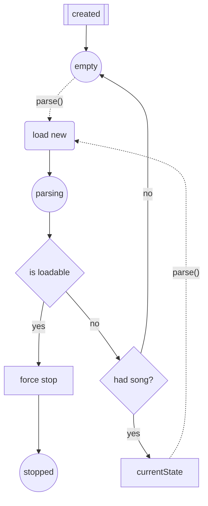
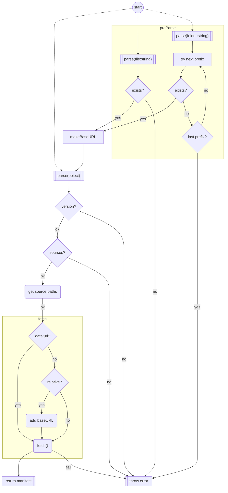
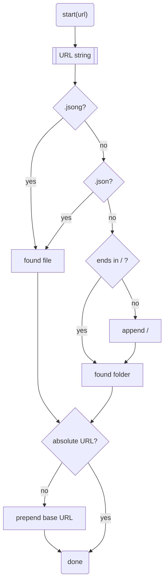
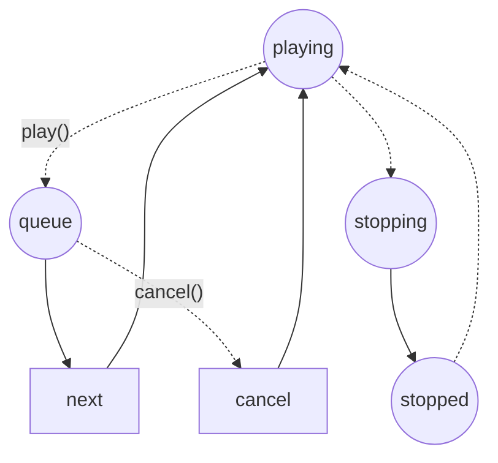
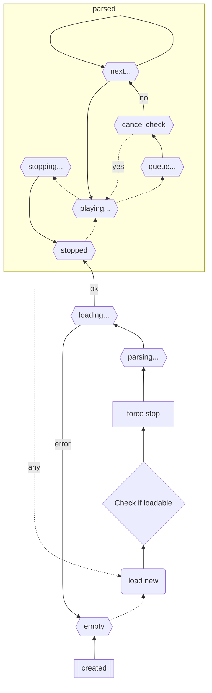

# Parsing from different states

Circle shapes are player states.

Solid lines indicate automatic progression, dashed/dotted lines are user actions.

The user can request to load a song at any time from any state of the player.



# Path resolution



# Check Path


# Player ready states


## More complete states


# Sample usage
```js

const jsong = new JSONg("example.jsong")
jsong.addEventListener("sectionQueue",queuedSection)
jsong.addEventListener("sectionChange",changedSection)

jsong.play()
setTimeout(async ()=>{
	await jsong.play()
	json.play()
},1000)


function queuedSection(ev){
	console.log("Will change sections",ev.from, ev.to)
	//do visual effects to signal upcoming changing of sections
}

function changedSection(ev){
	console.log("Did change sections",ev.from, ev.to)
	//stop effects on section change
}

```

