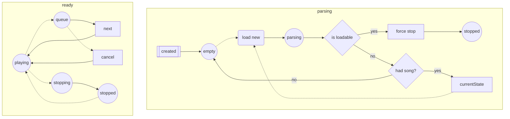

# Parsing from different states

Circle shapes are player states.

Solid lines indicate automatic progression, dashed/dotted lines are user actions.

The user can request to load a song at any time from any state of the player.

